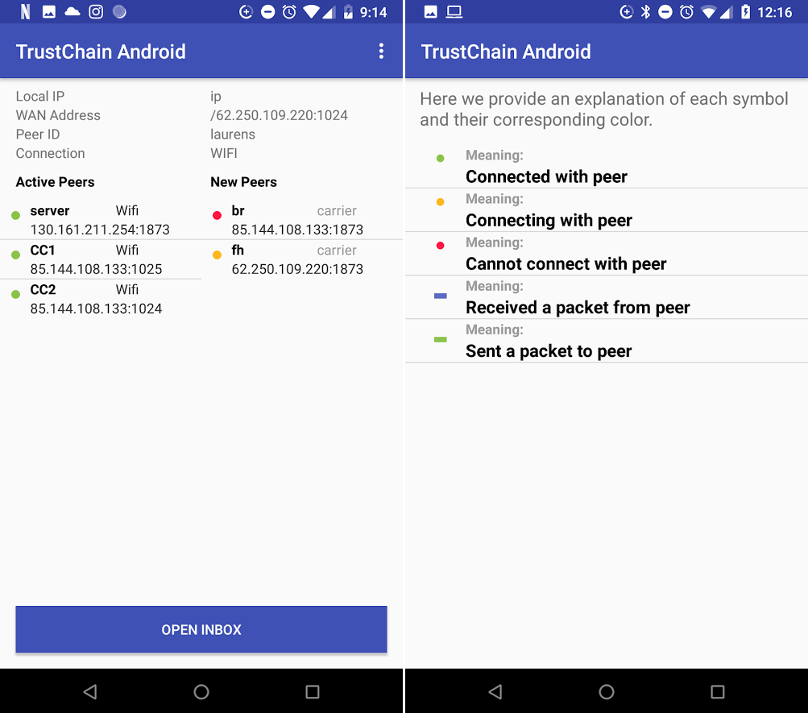
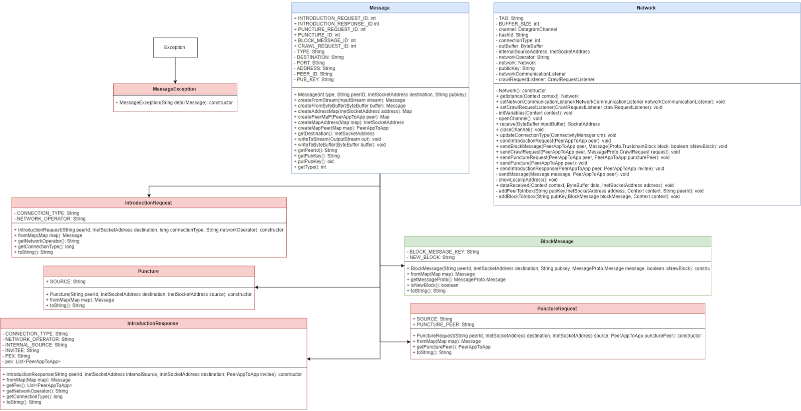

************************
Connection to a peer
************************

In order to be part of the network, you need to be connected to other people (peers). The underlying protocol for finding peers was taken from App-To-App Communicator <https://github.com/Tribler/app-to-app-communicator>. This protocol enables a peer to discover more peers through peers they are already connected with. By default firewalls will block incoming connections from unknown sources. The protocol makes use of `UDP hole punching <https://en.wikipedia.org/wiki/UDP_hole_punching>`_ to circumvent this and setup direct connections between peers. Basically this uses a mutual friend to initiate a connection between two peers who are unknown to each other.

The protocol consists of the following messages:
- IntroductionRequest - Request for an introduction to some new peer.
- IntroductionResponse - Response with a new peer that could be connected to.
- PunctureRequest - Request to send a puncture to some peer.
- Puncture - A basically empty message, used to punch a hole in the NAT/firewall of the sender.

When a peer initially starts up the app, it needs to find other peers to connect to. For this initial peer discovery a bootstrap server is used. This bootstrap server resides on a fixed IP and introduces new peers to each other when they initially connect to the network.

The following steps explain how a typical introduction goes down:

1.	Peer A knows of some peer B and asks for a new connection to be setup.
2.	Upon connection peer B chooses a peer from its active connections, peer C, and sends the address of peer C to peer A as an introduction response message.
3.	Peer B sends peer C a puncture request for peer A.
4.	Peer C sends a puncture message to peer A to punch a hole in its own NAT/firewall, allowing the incoming connection from peer A.

.. figure:: ./images/intro_puncture_req.png
   :width: 300px
   :alt: Fig. 1. How a connection is setup between peers.

Connections overview
====================
After starting the app and choosing a username a screen is shown with an overview of all current connections. The screens is divided into two columns. The left column shows peers which are actively connected with you. The right screen shows peers, which you have heard about, but have yet to respond to you. They have been introduced to you through the IntroductionRequest message.

In order to prevent sending messages indefinitely to peers who aren't responding peers can time-out, the boostrap server will never time-out. Every five seconds a message is send to peers in either list, as a sort of heartbeat timer, to keep the connection open, or to have another attempt at connecting. If no messages were received in response for 25 seconds the connection is deemed to be lost and the peer will be removed from the list. A new introduction would have to take place to reconnect to the peer.

For each peer the following information is displayed:

Status light
 - green when a message was received in the last 15 seconds
 - orange when peer is new, but hasn't responded yet
 - red when no message was received in the last 15 seconds, a strong indicator that the connection is lost

Username
The username the peer chose when first starting the app

Server indicator 
In case the peer is set as a boostrap server next to the username the word "Server" is displayed

/////////////////Information about the type of connection, WiFi or network operator information. In case of the bootstrap server this states "server". Note that this field is obtained from the android OS and might not always be correct. It might display a mobile connection

Ip address
The public ip address of the peer, plus the port of the connection

Last received and sent
In the bottom row two timers can be found indicating the time since the last message was received from and when the last message was sent to the peer.

Received and sent indicators
The UI shows when messages are send to a peer by displaying an orange bar below the status 'light' of the peer. A blue bar is shown when a message is received from the peer.

Background handling of peers
============================
- what happens when an introduction of a peer is received
- how are peers stored

Background handling of messages
===============================
Since all messages are created using protocolbuffers, it is easy to rebuild them on reception. When a message is received, the message type is checked and the appropriate functions are called to further handle the message. Messages not build with (the correct) protocolbuffers will simply be discarded.

- add screenshot

- peer timeouts
- reconnecting to peers when app is closed
	- in memory for now

- background
	- socket
	- saving peers

- classes and their responsibilities

Networking classes and their responsibilities
=============================================
There are two main classes which have to do with networking. Network and OverviewConnectionsActivity.

The Network class is a singleton class and is responsible for sending and receiving messages. It has a datagram channel which has a socket bound to a local port (default 1873). Through this channel messages are send and received to and from peers. The network class has methods to build the different messages of the protocol.

The OverviewConnectionsActivity class is responsible for handling the messages after they have been deserialized. Furthermore it updates the information in the UI based on the messages it receives. This includes adding and removing peers and updating the connection information.

Connection
============
When the Trustchain Android app has started, on the background the app opens an User Datagram Protocol (UDP) datagram port (per default this is 1873) on the local phone and a listening thread in order for the phone to be able to receive datagram packets from other phones. After that, the client tries to connect to the bootstrap server, which is denoted by “server” in Figure 2. Figure 2 also shows what a user sees after selecting a username. It shows a peer’s local IP, WAN address, name and connection type. Furthermore the right column shows peers that are in the network but where you haven’t made a successful connection with. The left column on the other hand shows peers that are ready to connect since you have made a successful connection with them. The server needs to be publicly accessible in order to function as a bootstrap of the peer to peer network so it will almost immediately shift to the left side and with a green dot in front of it. After a connection has been made with the bootstrap, several puncture requests will be made in order to establish a direct UDP connection with the other peers. These puncture requests are like the ones stated in Fig. 1, executed with the help of the bootstrap phone. After the punctures are received and therefore a hole has been punched in the NAT of each router adjacent to the phones, the respective peers will also go to the list “Active Peers” with also a green dot in front of them. Now you can press on the respective peers and add these peers to your inbox, more on this in :ref:`inbox`. For an explanation for the different colors of dots and bars please have a look at Fig 2. When a user closes the app, which means that he/she is inactive, the user will be removed after 25 seconds in order to avoid that the peerlist is showing inactive users.

Network and Messages
====================
The class Network is responsible for handling the data that is received either through a local or global internet connection. Although it should be noted that a listen thread for UDP datagrams should already be initialized on the local phone’s port in order to receive datagrams from other users over the internet. It handles all the different messages a peer is able to send and receive, these are all subclasses of the Message class. The program is able to send and receive the following messages:

BlockMessage - This is a message containing a half block or a full block. The distinction between a half block or a full block will be made by the receiver, the difference is that a half block has an empty value for the linked sequence number while this is not the case for a full block.
CrawlRequest - A crawl request is sent to another peer after you click on this peer in your inbox. After receival of this request a peer sends its own whole chain to the other party.
PunctureRequest - A puncture request is sent to another party already familiar with a new peer, not yet in the active peers list of the program. After receival a puncture will be send to the new peer.
Puncture - A puncture is actually nothing more than an empty message. It has the sole purpose to punch a hole in the NAT of the receiver and from that point one can send Introduction Messages to each other.
IntroductionRequest - An introduction request is sent to the party after their respective NAT has been punctured in order to retrieve more information about the other peer like network provider and WAN address.
IntroductionResponse - When the introduction request has been received the information will be provided to the other peer.

Network Class
==============
The UDP socket is made by using the DatagramChannel class <https://docs.oracle.com/javase/7/docs/api/java/nio/channels/DatagramChannel.html>. The implementation in TrustChain Android is done by a peer-to-peer model, each peer implements a listener thread at their socket which always listens for datagram packets from other users. Sending of the messages also makes use of the same UDP socket.

If, from looking at the source code, it is not yet clear how the connection is made, please look into other Android Developer Documentation <https://developer.android.com/reference/java/nio/channels/DatagramChannel.html> that can be found online.

UML Diagram of the code covering connection
===========================================
The color scheme used in this UML diagram is the following: Red objects are objects that are not changed compared to the App-To-App communicator. Blue blocks are altered in order to handle block messages and green blocks are completely new with this Android Trustchain app compared to the communicator.

