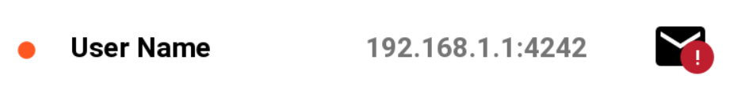
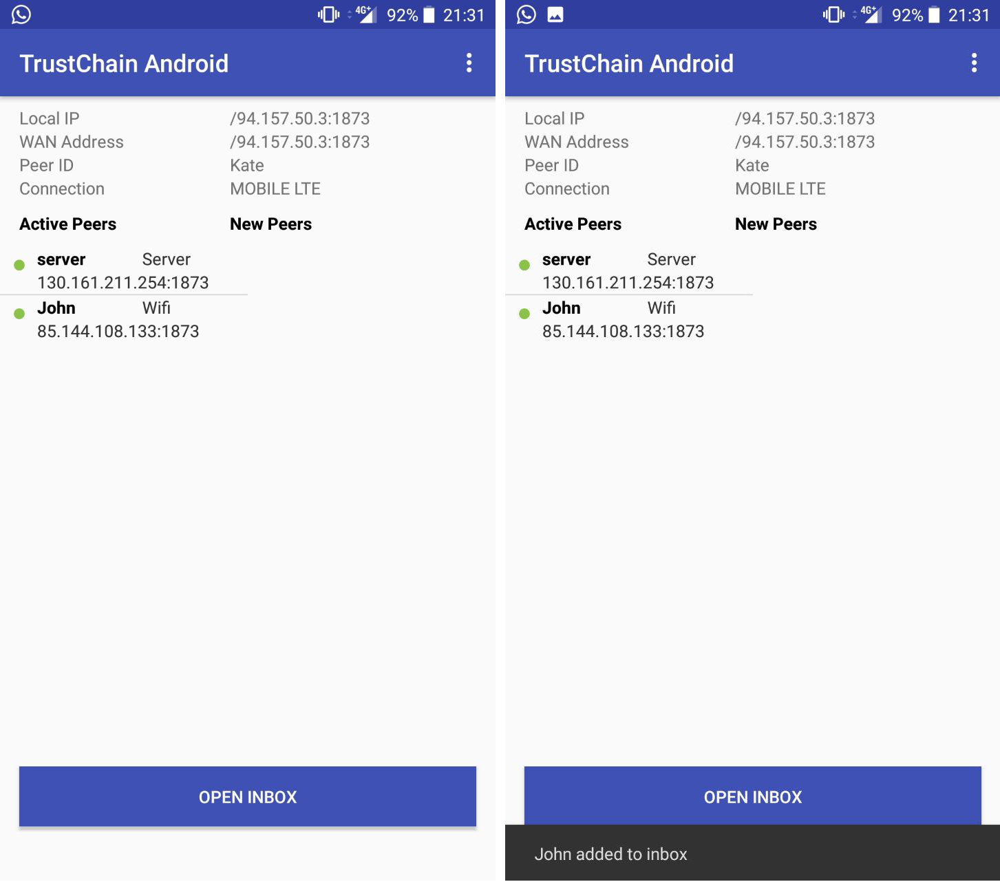
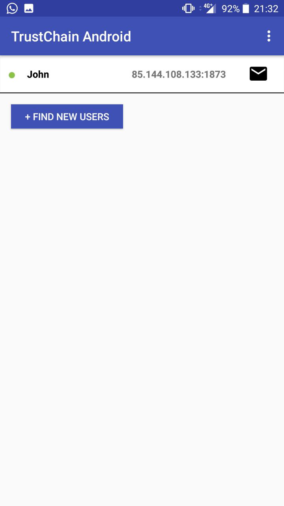
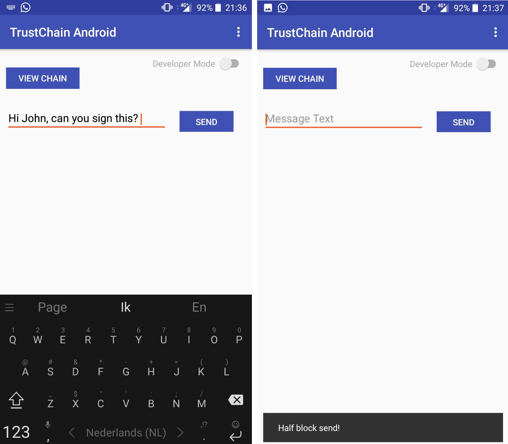
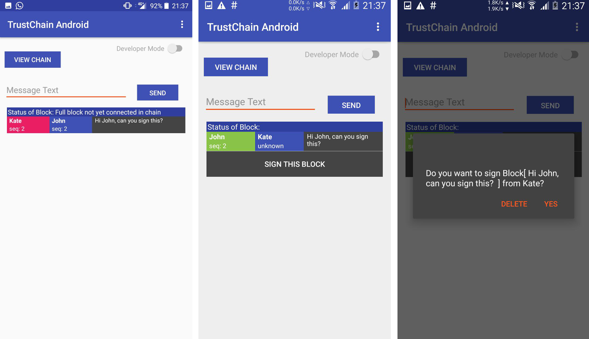

**************
Inbox
**************

The inbox stores all the (half)blocks that other peers have sent to the current user; it is the same concept as the inbox of your email. In the following subsections, we provide an explanation on why we have chosen to implement an inbox in this app and how this feature works in the app.

The inbox provides an overview of all the peers. A peer can be added manually to the inbox. A peer is also added when you receive a new half block from a peer that is not in your inbox list. The inbox item consists of:

- Colored circle, indicating peer status (see Fig. 1)
- IP address combined with port
- Mail icon with indicator if there is an unread block

===============
Why an inbox?
===============

In the first version of this app, it was only possible for the user to send/sign a (half)block if they have a live connection with the peer that they wish to communicate with. The drawback of this design was that both the user and the peer needs to be online at the same time. This might be troublesome for the user or the other peer, as they would have tell each other to come online each time that they want to send a block to each other. With the inbox, no live connection is needed between the user and the peer. All incoming (half)blocks are stored locally and users can review them later on when they are available to do so.

==============================
How does it work in the app?
==============================

In the main screen of the app, the user can add a peer to their inbox. This is shown in Fig. 2.

After a peer has been added to the inbox, the user can open their inbox by clicking on the button that is located on the bottom of the screen. The user can see the peers that they have added to their inbox. This is shown in Fig. 3.

The user can then click on the peer to send a (half)block to the peer. This is shown in Fig. 4.

The user can also see all the (half)blocks that they have sent to a peer and (half)blocks that they have received from a peer. The user is also provided with the option to sign the block if it has not been signed yet. This is shown in Fig. 5.

